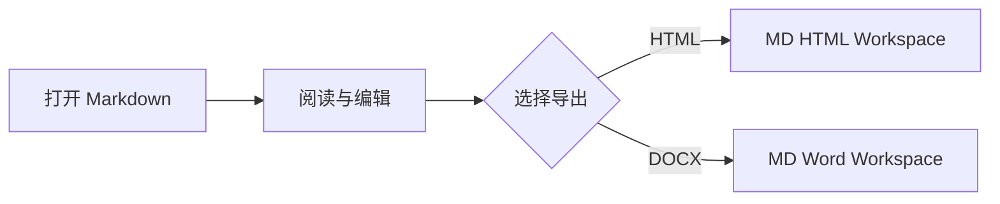

# Markdown Workspace 功能演示

[[TOC]]

> [!NOTE]
> 这是一个本地演示文档，可用于检查阅读、编辑、查找替换和导出效果。

## 文本与链接

支持 **粗体**、*斜体*、~~删除线~~、`行内代码`、==高亮==、++插入标记++、上标 x^2^ 和下标 H~2~O。

访问 [项目说明](../README.md)，或者选中“项目说明”后触发查找。

HTML 是一种标记语言。

*[HTML]: HyperText Markup Language

## 任务列表

- [x] 打开 Markdown
- [x] 在阅读界面编辑
- [ ] 配置可选分享服务
- [ ] 导出最终文档

## 表格

| 工具 | 目标格式 | 适用场景 |
| --- | --- | --- |
| MD HTML Workspace | HTML / PDF | 网页交付与浏览器阅读 |
| MD Word Workspace | DOCX / PDF | Word 编辑与办公交付 |

## 代码

```javascript
function greet(name) {
  return `Hello, ${name}!`;
}

console.log(greet('Markdown'));
```

## 数学公式

行内公式：$E = mc^2$。

块级公式：

$$
\sum_{i=1}^{n} i = \frac{n(n+1)}{2}
$$

## Mermaid



## 引用和脚注

> 好的文档流程应当让内容保持可编辑，同时能快速交付给不同读者。

分享服务是可选能力，默认不会上传本地文档。[^privacy]

[^privacy]: 只有主动配置上传接口并点击 Share 后，文档才会发送到对应服务。
